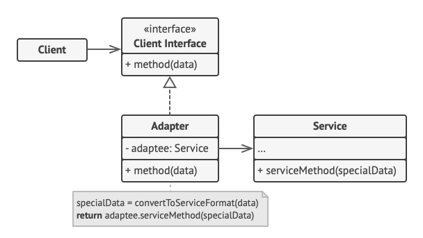
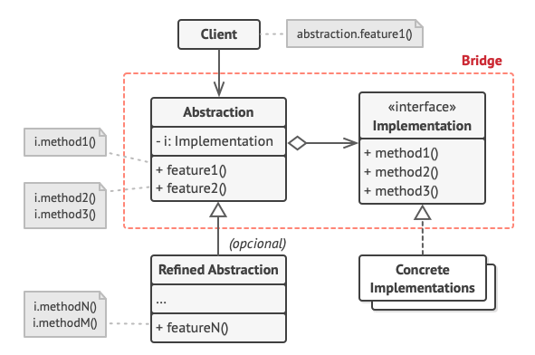

# Design Patterns - Structural

Os padrões estruturais explicam como montar objetos e classes em estruturas maiores mas ainda mantendo essas estruturas flexíveis e eficientes.

# Adapter

O **Adapter** é um padrão de projeto estrutural que permite objetos com interfaces incompatíveis colaborarem entre si.

## Diagrama



### Estrutura

- O **Cliente** é uma classe que contém a lógica de negócio do programa existente.

- A **Interface do Cliente** descreve um protocolo que outras classes devem seguir para ser capaz de colaborar com o código cliente.

- O **Serviço** é alguma classe útil (geralmente de terceiros ou código legado). O cliente não pode usar essa classe diretamente porque ela tem uma interface incompatível.

- O **Adaptador** é uma classe que é capaz de trabalhar tanto com o cliente quanto o serviço: ela implementa a interface do cliente enquanto encobre o objeto do serviço. O adaptador recebe chamadas do cliente através da interface do cliente e as traduz em chamadas para o objeto encobrido do serviço em um formato que ele possa entender.

- O código cliente não é acoplado à classe concreta do adaptador desde que ele trabalhe com o adaptador através da interface do cliente. Graças a isso, você pode introduzir novos tipos de adaptadores no programa sem quebrar o código cliente existente. Isso pode ser útil quando a interface de uma classe de serviço é mudada ou substituída: você pode apenas criar uma nova classe adaptador sem mudar o código cliente.

### Implementação

```ts
// Digamos que você tenha duas classes com interfaces
// compatíveis: RoundHole (Buraco Redondo) e RoundPeg (Pino
// Redondo).
class RoundHole {
  constructor(private radius: number) {}

  getRadius(): number {
    // Retorna o raio do buraco.
    return this.radius;
  }

  fits(peg: RoundPeg) {
    return this.getRadius() >= peg.getRadius();
  }
}

class RoundPeg {
  constructor(private radius: number) {}

  getRadius(): number {
    // Retorna o raio do pino.
    return this.radius;
  }
}

// Mas tem uma classe incompatível: SquarePeg (Pino Quadrado).
class SquarePeg {
  constructor(private width: number) {}

  getWidth(): number {
    // Retorna a largura do pino quadrado.
    return this.width;
  }
}

// Uma classe adaptadora permite que você encaixe pinos
// quadrados em buracos redondos. Ela estende a classe RoundPeg
// para permitir que objetos do adaptador ajam como pinos
// redondos.
class SquarePegAdapter extends RoundPeg {
  // Na verdade, o adaptador contém uma instância da classe
  // SquarePeg.
  private peg: SquarePeg;

  constructor(peg: SquarePeg) {
    super(0);
    this.peg = peg;
  }

  getRadius(): number {
    // O adaptador finge que é um pino redondo com um raio
    // que encaixaria o pino quadrado que o adaptador está
    // envolvendo.
    return (this.peg.getWidth() * Math.sqrt(2)) / 2;
  }
}

// Em algum lugar no código cliente.
const hole = new RoundHole(5);
const rpeg = new RoundPeg(5);
hole.fits(rpeg); // true

const small_sqpeg = new SquarePeg(5);
const large_sqpeg = new SquarePeg(10);
// Isso não vai compilar (tipos incompatíveis).
hole.fits(small_sqpeg);

const small_sqpeg_adapter = new SquarePegAdapter(small_sqpeg);
const large_sqpeg_adapter = new SquarePegAdapter(large_sqpeg);
hole.fits(small_sqpeg_adapter); // true
hole.fits(large_sqpeg_adapter); // false
```

## Getting Started

Usando NPM:

```bash
npm run dev --adapter target
```

Usando Yarn:

```bash
yarn dev --adapter target
```

# Bridge

O **Bridge** é um padrão de projeto estrutural que permite que você divida uma classe grande ou um conjunto de classes intimamente ligadas em duas hierarquias separadas — abstração e implementação — que podem ser desenvolvidas independentemente umas das outras.

## Diagrama



### Estrutura

- A **Abstração** fornece a lógica de controle de alto nível. Ela depende do objeto de implementação para fazer o verdadeiro trabalho de baixo nível.

- A **Implementação** declara a interface que é comum para todas as implementações concretas. Um abstração só pode se comunicar com um objeto de implementação através de métodos que são declarados aqui.<br><br>A abstração pode listar os mesmos métodos que a implementação, mas geralmente a abstração declara alguns comportamentos complexos que dependem de uma ampla variedade de operações primitivas declaradas pela implementação.

- **Implementações Concretas** contém código plataforma-específicos.

- **Abstrações Refinadas** fornecem variantes para controle da lógica. Como seu superior, trabalham com diferentes implementações através da interface geral de implementação.

- Geralmente o **Cliente** está apenas interessado em trabalhar com a abstração. Contudo, é trabalho do cliente ligar o objeto de abstração com um dos objetos de implementação.

### Implementação

```ts
// A "abstração" define a interface para a parte "controle" das
// duas hierarquias de classe. Ela mantém uma referência a um
// objeto da hierarquia de "implementação" e delega todo o
// trabalho real para esse objeto.
class RemoteControl {
  constructor(protected device: Device) {}

  togglePower(): void {
    if (this.device.isEnabled()) {
      this.device.enable();
    } else {
      this.device.disable();
    }
  }

  volumeDown(): void {
    this.device.setVolume(this.device.getVolume() - 10);
  }

  volumeUp(): void {
    this.device.setVolume(this.device.getVolume() + 10);
  }

  channelDown(): void {
    this.device.setChannel(this.device.getChannel() - 1);
  }

  channelUp(): void {
    this.device.setChannel(this.device.getChannel() + 1);
  }
}

// Você pode estender classes a partir dessa hierarquia de
// abstração independentemente das classes de dispositivo.
class AdvancedRemoteControl extends RemoteControl {
  constructor(device: Device) {
    super(device);
  }

  mute(): void {
    this.device.setVolume(0);
  }
}

// A interface "implementação" declara métodos comuns a todas as
// classes concretas de implementação. Ela não precisa coincidir
// com a interface de abstração. Na verdade, as duas interfaces
// podem ser inteiramente diferentes. Tipicamente a interface de
// implementação fornece apenas operações primitivas, enquanto
// que a abstração define operações de alto nível baseada
// naquelas primitivas.
interface Device {
  isEnabled(): boolean;
  enable(): void;
  disable(): void;
  getVolume(): number;
  setVolume(percent: number): void;
  getChannel(): number;
  setChannel(channel: number): void;
}

// Todos os dispositivos seguem a mesma interface.
class Tv implements Device {
  // ...
}

class Radio implements Device {
  // ...
}

// Em algum lugar no código cliente.
const tv = new Tv();
const remote = new RemoteControl(tv);
remote.togglePower();

const radio = new Radio();
const advancedRemote = new AdvancedRemoteControl(radio);
advancedRemote.mute();
```

## Getting Started

Usando NPM:

```bash
npm run dev --bridge tv
```

Usando Yarn:

```bash
yarn dev --bridge tv
```
